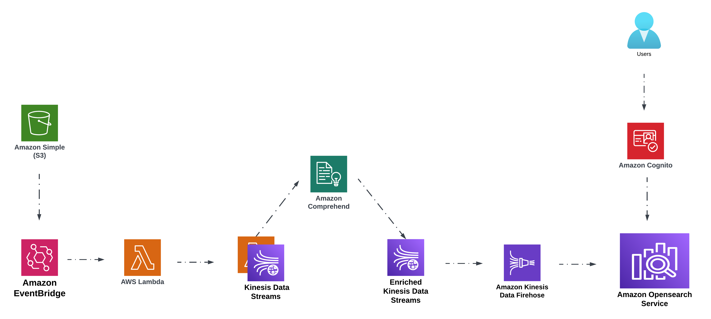

# 🕵️ AI/ML Real-Time OpenSearch + Comprehend — Sentiment Insights



> Investigative, real-time sentiment analytics across streaming social content **and** batch survey data. Text is enriched with [Amazon Comprehend](https://docs.aws.amazon.com/comprehend/latest/dg/how-sentiment.html) and made searchable in [Amazon OpenSearch Service](https://docs.aws.amazon.com/opensearch-service/) with secure access via [Amazon Cognito](https://docs.aws.amazon.com/cognito/). Infrastructure is automated with **Terraform / CloudFormation** for repeatability and scale.

---
##
## Overview

This repository contains **two end‑to‑end AWS pipelines** showcasing near real-time and event-driven sentiment analysis patterns:

| Pipeline | Purpose | Data Source | Processing Mode | Output |
|----------|---------|-------------|-----------------|--------|
| Twitter Sentiment Insights | Monitor live public conversations (hashtags / keywords) | X (Twitter) API streaming (and optional S3 batch) | Real-time streaming (Kinesis) | Indexed documents + dashboards in OpenSearch |
| Survey Sentiment (Workshop) | Analyze uploaded survey feedback (CSV) | Amazon S3 uploads | Event-driven (S3 -> SQS -> Lambdas / Step Functions) | Enriched searchable sentiment records |

Both pipelines highlight:
* Real-time or near real-time **sentiment enrichment**
* **Scalable ingestion** (streaming + batch)
* **Secure dashboard access** with Cognito
* **Infrastructure-as-Code** for reproducibility

---

## 🔎 Why this matters

* **Investigative analysis:** Monitor social narratives or internal/customer feedback continuously.
* **Sentiment at scale:** Thousands of text records automatically classified (Positive, Negative, Neutral, Mixed) with confidence scores.
* **Actionable insights:** OpenSearch Dashboards enable filtering by topic, timeframe, or sentiment distribution.
* **Enterprise-ready:** IAM, Cognito, CloudWatch, and optional KMS integration.

---

## ⚙️ Architecture Summaries

### Pipeline 1: Twitter Streaming (Real-Time)

1. **Collect Tweets** – Stream by hashtag / keyword via [X (Twitter) API](https://developer.x.com/en/docs/x-api) or optionally drop historical CSV/JSON into S3.
2. **Process & Classify** – Lambda functions normalize text and call Comprehend for sentiment.
3. **Stream & Deliver** – Kinesis Data Streams → Kinesis Data Firehose deliver enriched items to OpenSearch.
4. **Search & Visualize** – OpenSearch + Cognito-authenticated dashboards.
5. **Observe & Secure** – CloudWatch Logs, IAM, optional KMS.

### Pipeline 2: Survey Data (Workshop)

1. **Data Ingestion** – Upload CSV survey files to S3 (e.g., `reinvent-survey-data-2023-<account-id>`).
2. **Event Orchestration** – S3 notifications → SQS; EventBridge + Step Functions coordinate OpenSearch index setup and Cognito users.
3. **Sentiment Analysis** – Lambda functions batch or record-wise call Comprehend and enrich payloads.
4. **Index & Search** – Firehose (or direct client) writes enriched documents to OpenSearch for exploration.

---

## 🛠 AWS Services Used

| Service | Role |
|---------|------|
| Amazon S3 | Input datasets (batch tweets or survey CSVs) |
| Amazon SQS | Buffer layer for S3 event notifications |
| Amazon EventBridge | Event routing / orchestration |
| AWS Lambda | Text processing, Comprehend integration, index/bootstrap logic |
| Amazon Comprehend | Sentiment classification |
| Amazon Kinesis Data Streams | Real-time ingestion (Twitter pipeline) |
| Amazon Kinesis Data Firehose | Delivery into OpenSearch |
| Amazon OpenSearch Service | Search + dashboards |
| Amazon Cognito | Secure analyst access |
| AWS Step Functions | Workflow coordination (survey pipeline setup) |
| Amazon CloudWatch | Centralized logging / metrics |
| AWS KMS (optional) | Encryption of data at rest / secrets |

---

## ✅ Key Features

* Pre-packaged Lambda deployment artifacts (zip from S3).
* Terraform / CloudFormation automation for rapid provisioning.
* Multi-ingestion model (streaming + batch).
* Cognito-secured dashboards (ready for RBAC extension).
* Extensible design (plug in entity extraction, topic modeling, additional ML transforms).

---

## 🚀 Quick Start

```bash
# Clone the repo
git clone https://github.com/yourusername/aiml-realtime-opensearch-comprehend-sentiment-insights.git
cd aiml-realtime-opensearch-comprehend-sentiment-insights

# (Python) Install local helper dependencies
pip install -r requirements.txt

# Initialize & deploy (Terraform example)
terraform init
terraform apply
```

Then:

1. Configure X (Twitter) API credentials (if using streaming pipeline) and start ingestion.
2. Or upload a survey CSV to the configured S3 bucket.
3. Open the provisioned OpenSearch Dashboards URL, authenticate via Cognito, and explore indices (filter by sentiment, timeframe, hashtag, keyword, or survey dimension).

---

## 📈 Demo Scenarios

* **Twitter Insight** – Track `#AIRegulation` tweets in real time; visualize shifts in Positive vs. Negative tone.
* **Survey Insight** – Upload customer feedback CSV; quickly segment by sentiment to prioritize follow-up.

---

## 🔮 Coming Soon / Enhancements

* Pre-built OpenSearch dashboard JSON import (visualizations & index patterns)
* Fine-grained OpenSearch access control (role-based dashboards)
* Additional ML enrichments: entity extraction, key phrase, topic modeling
* Optional Glue/Athena lake export & historical trend backfill

---

## 👥 Credits

This project merges two AWS sentiment analysis reference architectures (streaming + survey) for practitioners (data engineers, architects, analysts) exploring real-time NLP patterns on AWS.

---

## Meta

**Repository name:** `aiml-realtime-opensearch-comprehend-sentiment-insights`

**GitHub description (short):** Investigative real-time AI/ML pipelines: stream tweets via X (Twitter) API or ingest survey CSVs, classify sentiment with Amazon Comprehend, search enriched insights in OpenSearch dashboards. Terraform/CloudFormation-managed for scale.

---

### Next Step Decision

Would you prefer to:

1. Keep this unified README (current state), or
2. Split deeper documentation into `pipelines/twitter/README.md` and `pipelines/survey/README.md` while keeping this root as an overview?

Let me know your preference and I can scaffold the per-pipeline docs accordingly.
